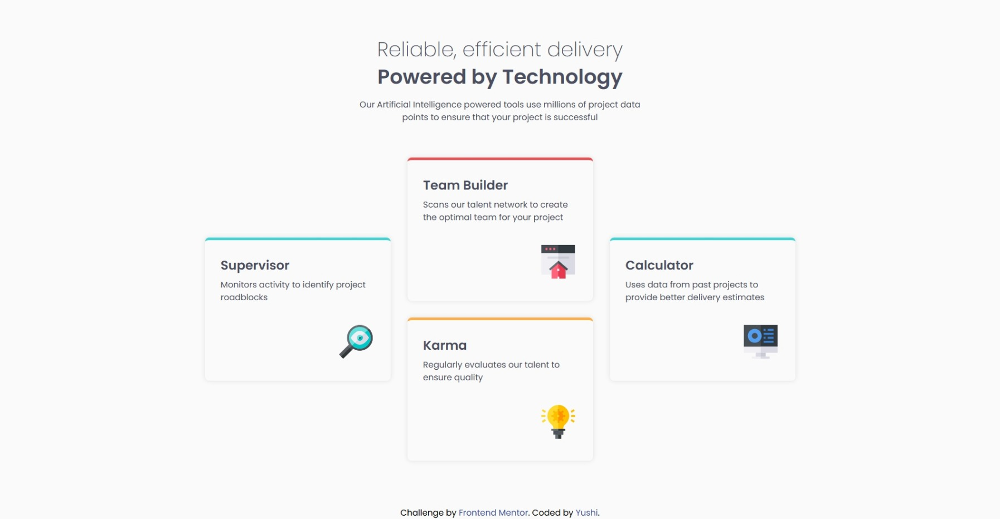

# Frontend Mentor - Four card feature section solution

This is a solution to the [Four card feature section challenge on Frontend Mentor](https://www.frontendmentor.io/challenges/four-card-feature-section-weK1eFYK). Frontend Mentor challenges help you improve your coding skills by building realistic projects. 

## Table of contents

- [Overview](#overview)
  - [The challenge](#the-challenge)
  - [Screenshot](#screenshot)
  - [Links](#links)
- [My process](#my-process)
  - [Built with](#built-with)
  - [What I learned](#what-i-learned)
  - [Useful resources](#useful-resources)
- [Author](#author)

## Overview

### The challenge

Users should be able to:

- View the optimal layout for the site depending on their device's screen size

### Screenshot

### Links

- Solution URL: [Solution](https://www.frontendmentor.io/solutions/four-card-feature-section-mobile-first-solution-using-flex-box-mNzzDNO-9D)
- Live Site URL: [Live Site](https://niisari.github.io/four-card-feature-section-master/)

## My process

### Built with

- Semantic HTML5 markup
- Flexbox
- CSS Grid
- Mobile-first workflow

### What I learned

I've learned how to work with css grid.

### Useful resources

- [Wesbos](https://courses.wesbos.com/account/access/690e3dfbb4c43be5da6460f0) - This helped me greatly with css grid.

## Author

- Frontend Mentor - [Yushi](https://www.frontendmentor.io/profile/Niisari)

